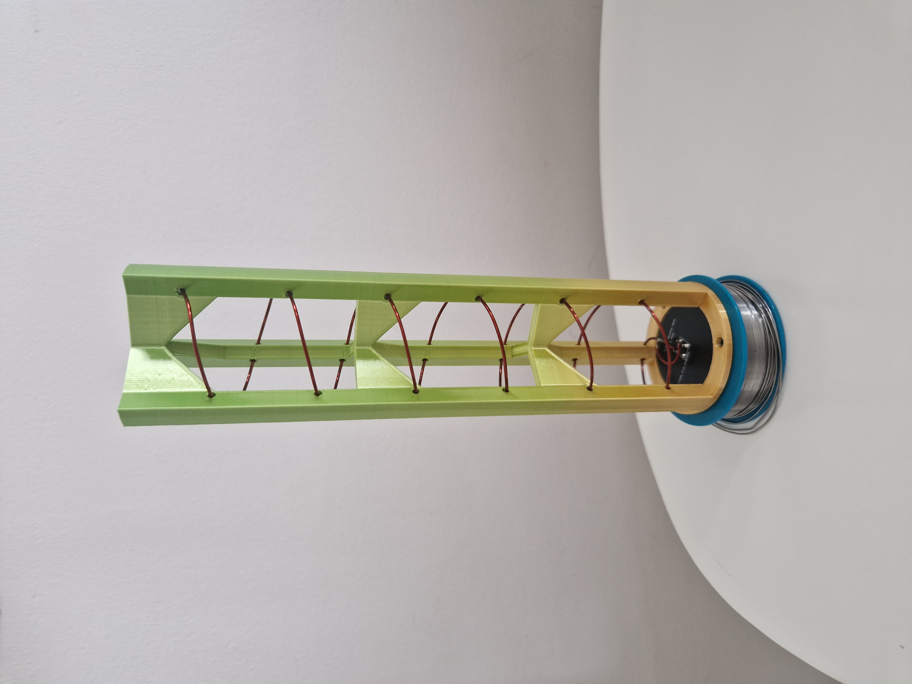
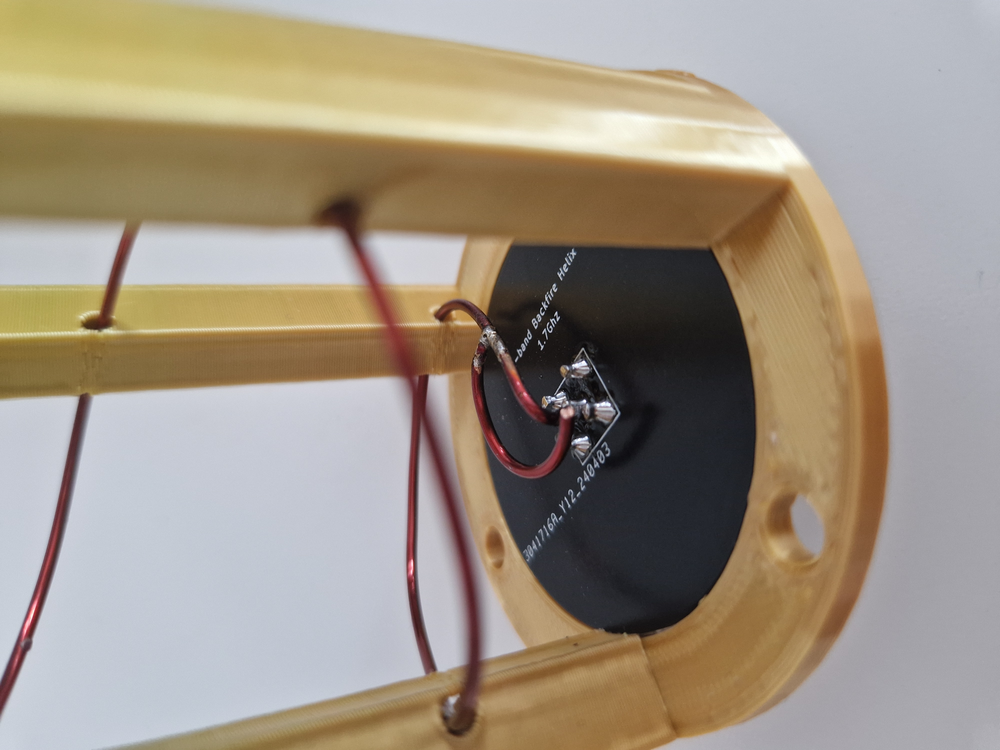
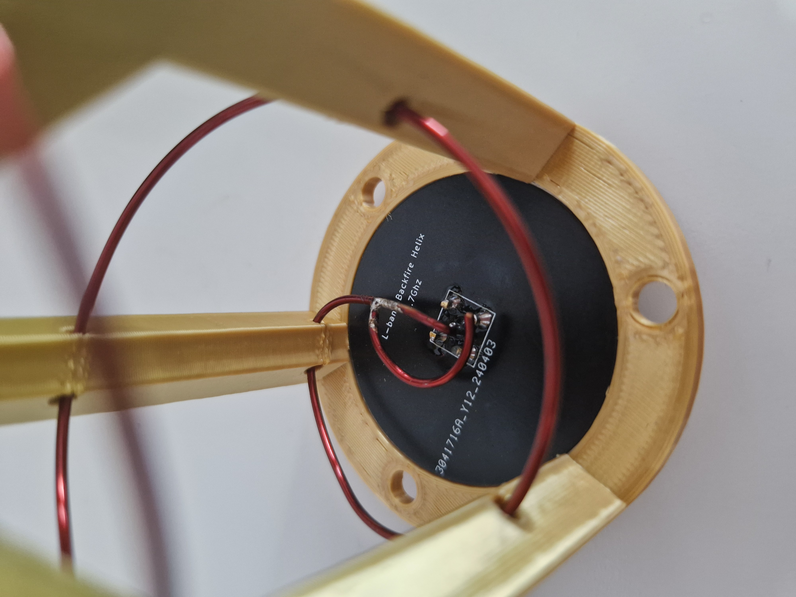
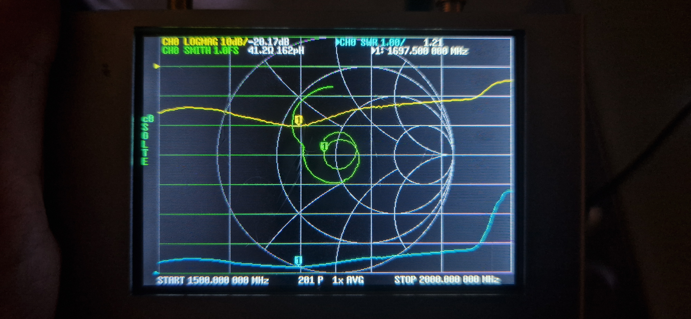
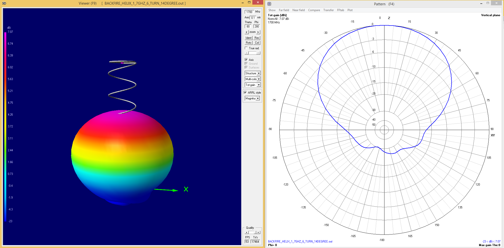
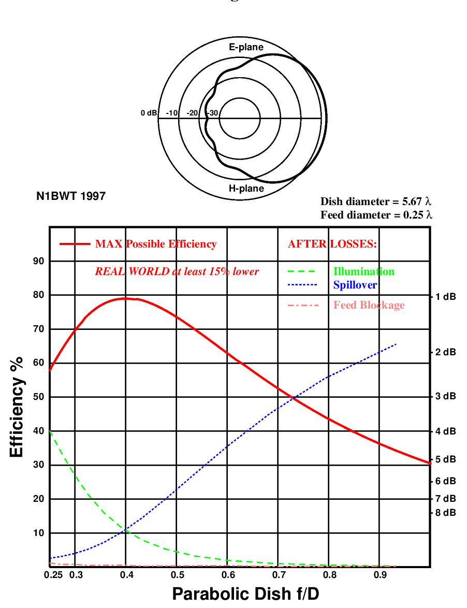

# Backfire helix antenna for L and S band weather satellites

This feed is suitable for deep prime focus dishes with an f/D ratio ranging from 0.3 to 0.5. Considering the mirroring effect the dish has on signal polarization, this feed is designed as LHCP; with the dish flipping it, making reception of RHCP satellite signals suitable.

Please read carefully the notes below before you start building it yourself!

## Background

The original "WiFi" grid and the Nooelec grid dishes come with linear polarized feeds. However, L-band polar-orbiting weather satellites transmit circularly polarized signals.  This polarization mismatch results in a 3 dB loss when using linear feeds. I wanted to design a circularly polarized feed to address this issue. After reading a lot about antenna feeds, I selected this particular design for its favorable characteristics and ease of construction. After simulation and real-world tests, it proved to work great on my setup; in contrast with the Nooelec's linear feed, I got about 3 dB better SNR.

This Backfire helix design is based on Hisamatsu Nakano, Junji Yamauchi, Hiroaki Mimaki: Backfire Radiation from a Monofilar Helix with a Small Ground Plane, IEEE TRANSACTIONS ON ANTENNAS AND PROPAGATION, VOL. 36, NO. 10, OCTOBER 1988

Another good resource is [W1Ghz antenna book](http://www.w1ghz.org/antbook/contents.htm).

The scaffold design is based on [Derek's](https://twitter.com/dereksgc) helix design.

## Important notes

- If you have a grid dish like a Wf-fi grid dish or Nooelec grid dish, it must be covered with a fine mesh wire, since these dishes is made for linear polarized signals.

- You'll find the PCB Gerber files for the backplate in the Gerber folder. If you decide to build the PCB, make sure it snugly fits into the antenna scaffold; otherwise, adjust the hole size with sandpaper or a sharp knife. The SMA connector I've used is [from Mouser](https://eu.mouser.com/ProductDetail/712-CONSMA001-C-G), but similar should work too.

- The size of the back plate plays an important role in the feed pattern! Using a random-sized plate will not work! Additionally, anything metallic around the backplate can negatively impact feed performance; therefore, it’s advisable to support the feed from underneath. Anything smaller than the backplate shouldn't alter feed characteristics. I haven't tested the metallic feed holder yet as I'm using a 3D-printed one and a PVC tube.

- The feed’s impedance is approximately 150 ohms. To achieve optimal performance, it needs to be tuned to 50 ohms to avoid an impedance mismatch and signal loss. Adding a tuning strip to the feed can help achieve a good VSWR of around 1.2. For precise matching, utilize a Vector Network Analyzer (VNA) to determine the correct strip or wire size—keep in mind that not any size will suffice. Antenna matching requires experimentation, adjusting wire distance from the backplate, tuning element length, and distance from the ground plate and center. See pictures for a reference.

- You must use the shortest cable possible for connecting the feed to the LNA, as cable length increases the received signal attenuation. I suggest you make your replacement antenna feed holder and fit an LNA right below the backplate if the one which came with the dish doesn't allow it. If that's not possible, use a good-quality low-loss coax.

- Nooelec's feed holder on their dish (like I have) is specifically designed for it. If you have a different dish, you must design a custom feed holder! The focal point of my helix differs from the original dipole feed. You must experiment to find the correct spot.

- While a regular helix functions as a wideband antenna, the radiation pattern of a backfire helix is significantly influenced by the frequency. Specifically, this design performs exceptionally well in the frequency range of 1650 to 1800 MHz.

- Holes on the scaffold are made for ~1.2mm wire.

- Holes for holding together the feed holder and the feed are for M3 bolts. You can use cable tiers too.

## Tuning pictures

## Simulation result

### NEC4 simulation with NEC2 engine 

### Dish efficiency using W1GHZ's feedpattern calculator

## Future

An LNA circuit could be made on the back plate. Coming soon!
